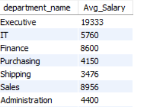
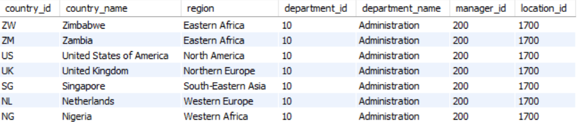

# Orion Data Systems Workforce Analytics Report
Analyzing HR workforce data using MySQL to support staffing, compensation, and global workforce planning.

## Executive Summary
- Orion Data Systems’ HR team lacked a centralized analytical view of workforce distribution, salary structure, and geographical staffing patterns across departments and job roles.
- Using MySQL, workforce data from multiple tables was integrated to generate actionable HR insights. The analysis examined employee distribution, salary trends, job role value, and country-level workforce costs.
- The results identified the department with the highest headcount, revealed significant salary differences across departments, classified employees into salary bands, and highlighted high-paying job roles. Additionally, the analysis showed countries with the highest salary expenditure and identified gaps in job-role staffing.

## The Business Problem
Orion Data Systems required a structured, data-driven understanding of its workforce to support HR strategy and organizational planning.

The stakeholders’ objective was to move from raw employee records to meaningful insights that answer key workforce questions.

### Key Questions Addressed
- How are employees distributed across departments?
- Which departments have the highest and lowest average salaries?
- What is the salary structure of the organization?
- Which countries have the highest workforce cost?
- Which employees earn above the company average?
- Which job roles are high-paying or currently unfilled?

## The Process (Methodology)
### Tools Used:
MySQL, SQL (JOIN, GROUP BY, CASE, CTE, Subqueries, Aggregate Functions)

### Data Sourcing & Overview
The dataset consists of four relational tables:
- office_employees – employee details, salary, department, job, and country
- dept – department information
- office_jobs – job titles and salary ranges
- office_countries – country names and regions

### Data Preparation
- Activated the working schema using USE capstone
- Previewed all tables using SELECT *
- Created a stored procedure to access all tables efficiently
- Established relationships using department_id, job_id, and country_id

### Data Preview

## Analysis & Insights
This section presents the workforce insights derived from the SQL queries.

### Workforce Distribution
- The number of employees in each department was calculated using COUNT and GROUP BY.
- The analysis identified the department with the highest headcount, indicating where most operational activities are concentrated.
- This helps HR understand staffing levels and plan recruitment or restructuring where necessary.

### Salary Comparison by Department
- The average salary per department was calculated using AVG.
- Findings show that:
- The Executive department has the highest average salary, indicating senior-level roles.
- The Shipping department has the lowest average salary, suggesting operational or entry-level positions.
- This highlights salary inequality across departments and supports compensation benchmarking.

### Salary Band Distribution
- Employees were grouped into three salary bands:
 Low (< 5000), Medium (5000 – 10000), High (> 10000)
The majority of employees fall within the medium salary band, indicating a strong mid-level workforce.
This provides insight into organizational seniority and promotion planning.

### Country-Level Workforce Presence
- The analysis showed the countries where the company operates and the number of departments in each country.
- Countries with more departments indicate higher operational presence and workforce concentration.
- This supports global workforce planning and regional expansion strategies.

### High Earners Analysis

Employees earning above the company-wide average salary were identified using a subquery.

These employees represent top talent, likely occupying senior or specialized roles.

This insight supports retention strategies and performance-based compensation planning.

### Job Role Value Analysis
- CTE was used to calculate the average salary for each job title.
- Only a few job roles have an average salary above 12,000, indicating high-value and specialized positions.
-This helps HR prioritize recruitment, training, and succession planning for critical roles.

### Salary Cost by Country
- Total salary expenditure was calculated for each country using SUM.
- Countries with the highest salary costs likely have larger workforces or more senior employees.
- This supports budgeting and cost optimization across regions.

### Workforce Gap Identification
- The analysis attempted to identify job roles without employees.
- This is important for detecting vacant positions and supporting recruitment planning.

## Recommendations
Based on the analysis, the following actions are recommended:
- HR should review departments with low headcount to determine staffing needs.
- Compensation structures should be evaluated to ensure fairness across departments.
- High-performing and high-earning employees should be targeted for retention programs.
- Recruitment should focus on filling critical job roles with no current employees.
- Countries with high salary costs should be reviewed for cost efficiency and workforce optimization.
- Training programs should be developed to prepare employees for high-value job roles.

## Links:
[MySQL Query Preview]

